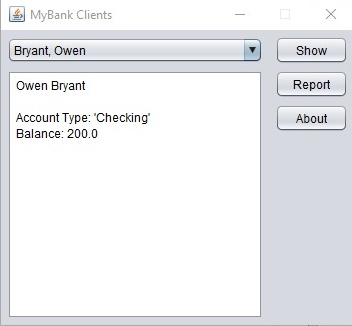
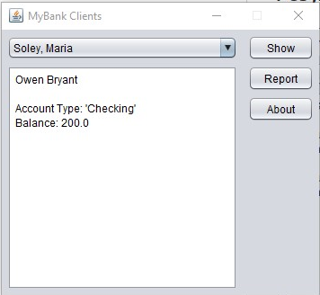
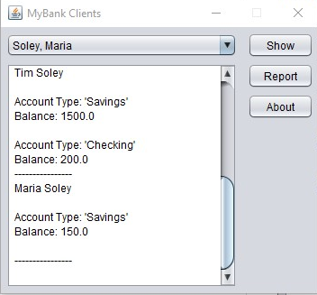
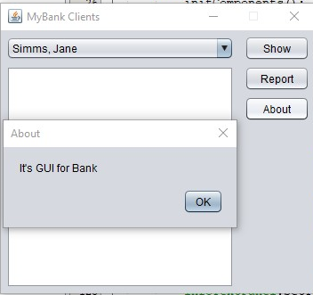

# UI Lab 4
## На "п'ять"
Кнопка Report має виводити у нижній частині вікна звіт за клієнтами такого ж виду, як у роботі номер 8 (див. CustomerReport).
Запустіть проект, впевніться, що все працює як очікувалось. Продемонстрируйте результат викладачеві.
## Результат

 
